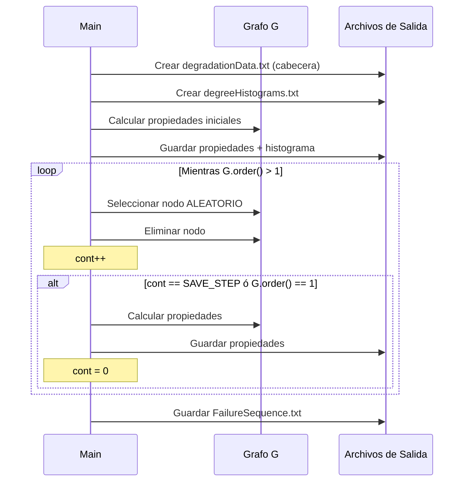
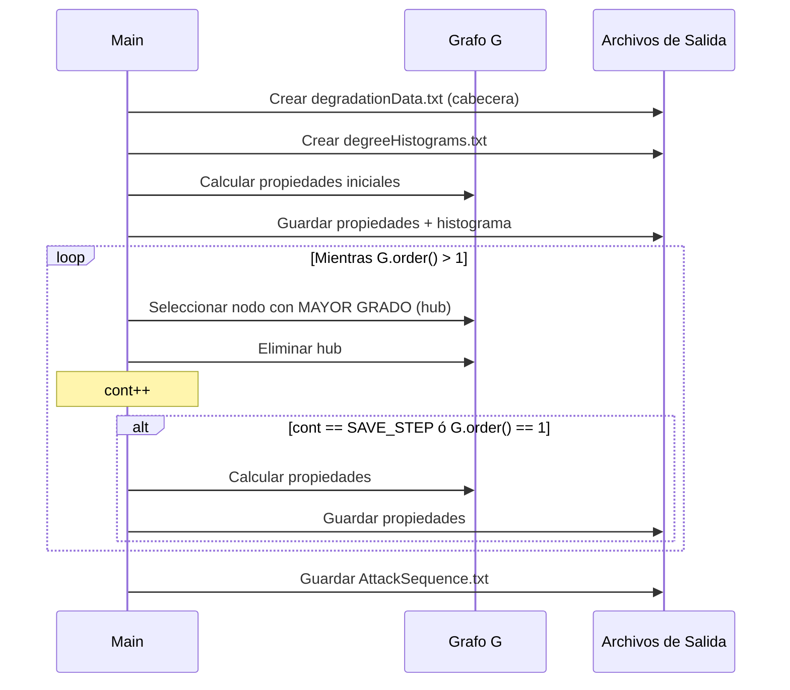

# Robustness — Evaluación de Robustez de Redes Complejas

## Descripción General

Este proyecto calcula la **robustez** de las redes complejas generadas por el [simulador de reconexión (rewiring)](file:///Users/usuario/Repositorios/rewiring). Evalúa cómo se degradan las propiedades estructurales de una red cuando se eliminan nodos progresivamente, bajo dos estrategias:

1. **Fallas aleatorias** — eliminación aleatoria de nodos (simula fallos no intencionados)
2. **Ataques dirigidos** — eliminación del nodo con mayor grado (hub) en cada paso

Forma parte del proyecto de Ciencia de Frontera **"Modelos de reconexión para la autoorganización de redes complejas de gran escala" (CBF-2025-G-1812)**, apoyado por la Secretaría de Ciencia, Humanidades, Tecnología e Innovación (SECIHTI).

---

## Pipeline de Ejecución

El flujo se ejecuta en **3 pasos secuenciales**:

### Paso 0: `degradacion.py` — Preparación y Ejecución

Este script tiene dos funciones que se ejecutan secuencialmente al correr el archivo:

#### Fase A: `copia_archivos_para_degradacion()`
- Itera sobre todo el espacio de parámetros (red × regla × ruteo × longitud_enlace × ejecución)
- Busca en `ResultadosCN/Formacion/` el grafo del **último ciclo** (`graph_test_*.adjlist`) de cada experimento
- Copia el grafo, el script de degradación correspondiente y `configDegradacion.py` a la carpeta de destino

#### Fase B: `ejecutar_degradacion()`
- Recorre la misma estructura de directorios en `ResultadosCN/Degradacion/`
- Ejecuta el script de degradación como **subproceso** en cada carpeta:
  ```
  python failureDegradation.py graph_test_5.adjlist /ruta/carpeta/
  python hubDegradation.py graph_test_5.adjlist /ruta/carpeta/
  ```

### Paso 1: `1creaPromediosDegradacion.py` — Promedios

- Recorre recursivamente el directorio de degradación
- Detecta carpetas con subdirectorios `1/`, `2/`, `3/` (ejecuciones)
- Para cada ejecución lee `degradationData.txt` y extrae métricas por paso de degradación
- **Calcula métricas adicionales**:
  - **A2TR (Accessibility to Two-Terminal Reliability)**: `Σ Ki(Ki-1) / N(N-1)` donde Ki es el orden de cada componente
  - **μA2TR**: promedio acumulado de A2TR a lo largo de toda la degradación
  - **Modularidad**: vía algoritmo de Louvain (`nx_comm.louvain_communities`)
- Escribe:
  - `datos-promedio.csv`: promedios de AvCl, ASPL, Diámetro, Orden Relativo CG, Asortatividad
  - `attr-promedio.csv`: μA2TR promedio/std y Modularidad promedio/std

### Paso 2: `2creaGraficasDegradacion.py` — Tablas Consolidadas

- Para cada combinación (tipo_degradación × regla × red × ruteo), consolida las métricas de todas las longitudes de enlace
- Genera archivos CSV finales en `Medidas_degradacion/Medidas_{tipo}/`:
  - `Medidas_{tipo}_{red}_R{r}_{routing}.csv`
- Cada CSV contiene secciones para: Coeficiente de Agrupamiento, ASPL, Diámetro, Orden Relativo CG, y Asortatividad
- Las columnas representan las diferentes longitudes de enlace (D1, D2, D4)

---

## Algoritmos de Degradación

### Fallas Aleatorias (`failureDegradation.py`)



**Estrategia**: `random.choice(list(G))` — selección uniforme aleatoria.

### Ataques Dirigidos (`hubDegradation.py`)



**Estrategia**: `max(G.degree(), key=lambda x: x[1])[0]` — siempre el nodo de mayor grado actual.

> [!NOTE]
> La diferencia clave: en **fallas** se usa `random.choice()` y se guarda `FailureSequence.txt`; en **ataques** se usa `max(G.degree())` y se guarda `AttackSequence.txt`. El grado se **recalcula** después de cada eliminación.

---

## Métricas Calculadas

### Por paso de degradación (`graph_properties()`)

| Métrica | Variable | Descripción |
|---------|----------|-------------|
| Número de nodos | `n_nodes` | Orden actual del grafo |
| Número de aristas | `m_edges` | Tamaño actual del grafo |
| ASPL | `aspl` | Longitud promedio de camino más corto |
| Diámetro | `diameter` | Diámetro del grafo/componente gigante |
| Clustering promedio | `a_clustering` | Coeficiente de agrupamiento promedio |
| Asortatividad | `assortativity` | Correlación de Pearson por grado |
| Conectividad por nodo | `node_connectivity` | Mínimo número de nodos a eliminar para desconectar |
| Nº componentes | `n_components` | Componentes conexas |
| Orden componente gigante | `order_L` | Nodos en el componente más grande |

> [!IMPORTANT]
> Cuando el grafo se fragmenta (`n_components > 1`), las métricas se calculan sobre el **componente gigante** (subgrafo más grande), no sobre todo el grafo.

### Métricas de robustez agregadas (`1creaPromediosDegradacion.py`)

| Métrica | Descripción |
|---------|-------------|
| **A2TR** | Accesibilidad de dos terminales: `Σ Ki(Ki-1) / N(N-1)`. Mide la probabilidad de que dos nodos aleatorios estén conectados |
| **μA2TR** | Promedio de A2TR a lo largo de toda la degradación. **Valor único** que resume la robustez |
| **Modularidad** | Calculada con el algoritmo de Louvain sobre el grafo **antes** de la degradación |
| **Orden relativo CG** | `order_L / n_nodes`: fracción de nodos en el componente gigante |

---

## Parámetros de Configuración

### `configFormacion.py` — Espacio de Experimentos (heredado de rewiring)

| Parámetro | Valor | Descripción |
|-----------|-------|-------------|
| `RED` | `["malla", "anillo"]` | Topologías |
| `ROWS×COLUMNS` | `8×8` | Dimensiones de malla (64 nodos) |
| `NODOS_ANILLO` | `64` | Nodos del anillo |
| `ROUTING` | `["SHORTEST-PATH", "COMPASS-ROUTING", "RANDOM-WALK"]` | Algoritmos de ruteo |
| `REGLAS` | `[1, 2, 3]` | Reglas de recableado |
| `LONG_ENLACES` | `[1, 2, 4]` | Divisores de longitud de enlace |
| `EJECUCIONES` | `4` | Repeticiones por experimento |

### `configDegradacion.py` — Configuración de Degradación

| Parámetro | Valor | Descripción |
|-----------|-------|-------------|
| `TIPO_DEGRADACION` | `["Fallas", "Ataques"]` | Estrategias de degradación |
| `SAVE_STEP` | `4` | Cada cuántas eliminaciones se registran métricas |

---

## Estructura de Resultados

```
ResultadosCN/
├── Formacion/                          ← INPUT (del proyecto rewiring)
│   ├── malla8x8/R1/CR/D1/1/
│   │   └── graph_test_5.adjlist
│   └── ...
│
└── Degradacion/                        ← OUTPUT (de este proyecto)
    ├── Fallas/
    │   ├── malla8x8/
    │   │   └── R1/CR/D1/
    │   │       ├── 1/
    │   │       │   ├── graph_test_5.adjlist     ← copia del grafo
    │   │       │   ├── failureDegradation.py    ← copia del script
    │   │       │   ├── configDegradacion.py     ← copia de config
    │   │       │   ├── degradationData.txt      ← métricas paso a paso
    │   │       │   ├── degreeHistograms.txt     ← histogramas de grado
    │   │       │   └── FailureSequence.txt      ← orden de eliminación
    │   │       ├── 2/ ... 4/
    │   │       ├── datos-promedio.csv            ← promedios entre ejecuciones
    │   │       └── attr-promedio.csv             ← μA2TR y Modularidad
    │   ├── anillo64/ ...
    │   └── ...
    ├── Ataques/
    │   └── (misma estructura, con AttackSequence.txt)
    └── Medidas_degradacion/
        ├── Medidas_Fallas/
        │   └── Medidas_Fallas_malla8x8_R1_CR.csv
        └── Medidas_Ataques/
            └── Medidas_Ataques_malla8x8_R1_CR.csv
```

---

## Espacio Total de Experimentos

| Dimensión | Valores | Total |
|-----------|---------|-------|
| Topologías | malla8x8, anillo64 | 2 |
| Reglas | R1, R2, R3 | 3 |
| Ruteo | SP, CR, RW | 3 |
| Long. enlace | D1, D2, D4 | 3 |
| Ejecuciones | 1–4 | 4 |
| Tipo degradación | Fallas, Ataques | 2 |
| **Total de degradaciones** | | **432** |

---

## Dependencias

- `networkx≥3.0` — grafos, métricas, comunidades (Louvain)
- `numpy≥1.24` — promedios y desviación estándar
- `matplotlib≥3.7` — listada en requirements pero **no usada** directamente en el código actual

---
